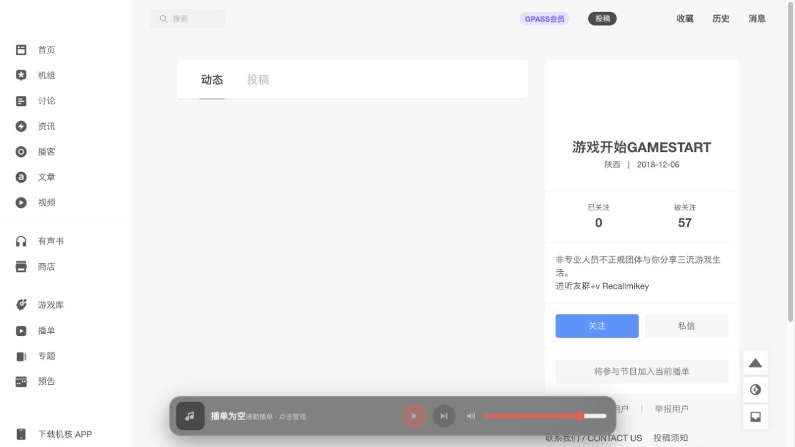

# 机核自定义播单

一个运行在 [机核 GCORES](https://www.gcores.com/) 网页端的 Tampermonkey 用户脚本，用独立的多播单、断点续播和二维码分享替代体验有限的原生播放队列。

> 本项目为非官方工具，与机核 GCORES 无隶属或合作关系。

## 当前能力

- 创建多个播单，并修改名称、删除播单。
- 从节目卡片右上角的“列表＋”按钮加入当前播单。
- 在播单内播放、移除节目以及调整顺序。
- 使用底部居中的磨砂玻璃播放器控制播放/暂停、下一期和音量。
- 每个播单分别保存当前节目和播放时间，下次从断点继续。
- 在用户页一键加入该用户作为 DJ/主播参与的全部公开节目，自动遍历分页并去重。
- 将播单导出为二维码或分享链接；接收者打开链接后可确认导入。
- 在官方全屏时间轴中，把评论区的结构化时刻评论同步显示为弹幕。
- 普通节目和当前机核账号有权限访问的会员节目均可播放。

## 界面截图

### 底部播放器


### 播单管理


### 用户参与节目批量加入



### 二维码分享与导入


### 时间轴评论弹幕


截图来自真实 `gcores.com` 页面和脚本实际运行状态，登录头像已隐藏。截图对应版本：v0.5.0。截图中的 GCORES 商标、页面界面、节目名称、封面和公开用户资料归各自权利人所有，不属于本项目 MIT 授权范围。

## 前置条件与安装

1. 安装 [Tampermonkey](https://www.tampermonkey.net/)（Chrome、Edge、Firefox 或 Safari）。
2. 点击 [安装脚本](https://github.com/bilisheep/gcores-custom-playlists/raw/refs/heads/main/gcores-custom-playlists.user.js)。
3. Tampermonkey 打开安装页后，确认脚本权限并点击“安装”。
4. 打开或刷新 [机核播客页](https://www.gcores.com/radios)。

也可以在 Tampermonkey 中新建脚本，将 [`gcores-custom-playlists.user.js`](gcores-custom-playlists.user.js) 的完整内容粘贴后保存。

## 配置

无需 API Key、服务器或构建步骤。脚本使用机核网页现有登录态访问节目资料和音频授权：

- 播放公开节目无需额外配置。
- 播放会员或付费节目时，需要先在机核网页登录具备对应权限的账号。
- 播单、进度和音量保存在 Tampermonkey 本地存储中，不会上传到第三方服务器。
- 多个机核标签页会同步播单和音量，并避免同时播放。

## 启动与使用

### 添加与管理节目

1. 在机核节目卡片右上角找到“列表＋”图标；它位于机核原生加号左侧。
2. 点击后，节目会加入当前选中的自定义播单。
3. 点击底部播放器左侧封面，会在新标签打开对应节目详情。
4. 点击封面右侧的标题或播单信息，打开自定义播单管理面板。
5. 使用顶部的 `＋`、`修改名字`、`删除播单` 管理播单。
6. 使用节目右侧按钮播放、上移、下移或移除节目。

### 播放和断点续播

- 底部播放器中间控制播放/暂停和下一期，右侧滑杆调整音量。
- 管理面板中的“从断点播放”会恢复该播单上次停止的节目和时间。
- 播放进度约每 5 秒保存，并在暂停、切换节目和关闭页面时补充保存。

### 批量加入某位用户参与的节目

1. 打开机核用户页。
2. 在“关注 / 私信”区域下方点击“将参与节目加入当前播单”。
3. 脚本会查询该用户作为 DJ/主播参与的全部公开节目，遍历所有分页后一次性加入。
4. 已在播单中的节目会自动跳过；重复点击不会产生重复项。

### 分享和导入

1. 打开播单管理面板，点击“二维码分享”。
2. 下载二维码，或复制分享链接。
3. 接收者需先安装本脚本，再扫描二维码或打开链接。
4. 机核页面会显示导入确认；确认后脚本根据节目 ID 获取最新节目资料并创建新播单。

二维码只包含播单名称和节目 ID，不包含播放进度、账号信息或音频地址。

### 时间轴评论弹幕

1. 使用机核官方播放器打开某期节目，并进入全屏时间轴。
2. 脚本会分页加载该节目全部带“时刻”标记的公开评论。
3. 播放经过评论的 `radio-timestamp` 时，评论正文会在时间轴区域从右向左移动。
4. 右上角“弹幕：开/关”控制是否显示弹幕；设置保存在 Tampermonkey 本地存储中。

弹幕正文会移除开头时间文本并最多显示 80 个 Unicode 字符。弹幕最多同时占用 4 条轨道，轨道满时直接丢弃而不会延迟刷屏。暂停会冻结弹幕；seek 会清空当前弹幕且不补发跳过区间，向后 seek 后再次经过相应时刻可以重播。系统启用“减少动态效果”时，弹幕改为短暂静态显示。

## 已知限制

- 本地存储不会自动同步到另一台设备；可使用二维码或分享链接迁移播单。
- 单个二维码最多包含 200 期，并且分享链接不得超过 2800 字节。
- 会员节目的可播放性取决于接收者自己的机核账号权限。
- 机核页面结构或非公开 API 变化可能导致部分功能失效。
- 弹幕只作用于机核官方全屏时间轴，不显示在自定义底部播放器上；只使用接口返回的结构化时刻评论。

## 运行测试

无需安装依赖。使用 Node.js 执行语法检查和内置逻辑自检：

```bash
node --check gcores-custom-playlists.user.js
node -e "globalThis.__GCPL_TEST__=true; require('./gcores-custom-playlists.user.js'); if (!globalThis.__GCPL_TEST_RESULT__) process.exit(1); console.log('self-check passed')"
```

## 关键文档

- [项目定义](PROJECT.md)
- [产品需求](docs/00-prd/PRD.md)
- [总体设计](docs/01-design/project-design.md)
- [验收标准](docs/02-acceptance/acceptance-criteria.md)
- [第三方许可](THIRD_PARTY_NOTICES.md)

## 项目状态链接

当前状态见 [STATUS.md](STATUS.md)。

## 许可证

本项目由 `bilisheep` 维护并使用 [MIT License](LICENSE)。用户脚本元数据保留 `@author Codex`，用于标明初始实现来源。内嵌第三方代码及截图/商标的权利说明见 [THIRD_PARTY_NOTICES.md](THIRD_PARTY_NOTICES.md)。
